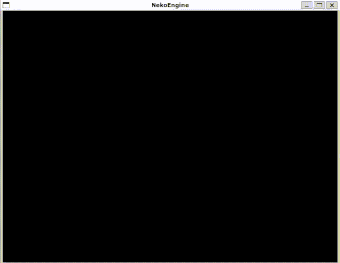

# R-Touhou

Creating a R-Type like game in C++, with multiplayer Co-Op.

# Contributors

> **Aurélien Schulz** aka [@Lisieshy](https://github.com/Lisieshy)

> **Eliott Ferry** aka [@EliottFerry](https://github.com/EliottFerry)

> **Pierre Fricker** aka [@Exy-tek](https://github.com/Exy-tek)

> **Thomas Moreau** aka [@zoomzoomzen](https://github.com/zoomzoomzen)

> **Tom Wederich** aka [@TheGorb](https://github.com/TheGorb)

# How To Compile (IMPORTANT!)

First of all, you need [Conan](https://conan.io)

Then, you need [CMake >=3.17](https://cmake.org)

You also obviously need g++ to compile the cpp code.

Once you have everything installed, follow these steps :

1. First of all, you need to create a new conan profile

        $ conan profile new --detect

2. Then, edit the profile by opening the .conan/profiles folder in your home directory

        for linux:

        code ~/.conan/profiles/

        for windows:

        code C:/Users/<USERNAME>/.conan/profiles

3. Edit the default profile (The one you created earlier just now!)<br>
   and change the `compiler.cxx=libstdc++` to `compiler.cxx=libstdc++11`.<br>
   You can also change the compiler version here to match the one you use on your PC.<br>
   You can also change the `build_type` variable to change between Debug, Release, MinSizeRel and RelWithDebInfo. Be sure to match the one you'll use with CMake in the next steps.<br>
   Here is what a sample profile would look like if you used g++-10 and were on Linux.

        [settings]
        os=Linux
        os_build=Linux
        arch=x86_64
        arch_build=x86_64
        compiler=gcc
        compiler.version=10
        compiler.libcxx=libstdc++11
        build_type=Release
        [options]
        [build_requires]
        [env]

4. Now, go back to the project and create the build directory by running

        $ mkdir build
        $ cd build

5. Now run these commands to install the dependencies and configure the project

        $ conan install .. --build=missing
        /* Installing Dependencies, wait for a few minutes. */
        /* Make sure the DCMAKE_BUILD_TYPE is the same as the build_type in your conan profile. */
        $ cmake .. -DCMAKE_BUILD_TYPE=Release -G "Unix Makefiles"
        $ make

6. For Windows, you should use cmake-gui and select Visual Studio 16 2019 for the target.

7. You're done! The compiled binaries will be located in ./build/bin/ !

If you're using WSL2, you can use both `linux.sh` and `windows.sh` to compile for both platforms, directly from Linux.<br>
!! THIS REQUIRES TO HAVE WSL2 AND WINDOWS 11 !!

# How To Use The NekoEngine

The NekoEngine is actually quite simple to use, but I'll explain the important stuff here.

First things first, you need to create a `ne::Scene`.<br>
It constructs and destroys itself at the beginning and end of the scope, as long as you don't define it as a global or static variable. Never, ever do that.

Once you have your scene, you need to register the components to the Coordinator so that it knows where and how to store them in memory.

But first, you need components to use!<br>
Components are as simple as it gets. They're only here to store data about the entities. Here are some example components.
```c++
// All files here are inside the namespace 'ne'.

// Transform.hpp
class Transform {
    public:
        ne::Math::Vector3f position;
        ne::Math::Vector3f rotation;
        ne::Math::Vector3f scale;
};

// Gravity.hpp
class Gravity {
    public:
        ne::Math::Vector3f force;
};

// RigidBody.hpp
class RigidBody {
    public:
        ne::Math::Vector3f velocity;
        ne::Math::Vector3f acceleration;
};
```

So now that you have components to register, you do it like this :
```cpp
//Including the Engine that already has some basics components.
#include <NekoEngine/NekoEngine.hpp>

auto main(
    void
    ) -> int
{
    // Creating the Scene
    ne::Scene mainScene;

    // Registering only the Transform component, it will be the only
    // one available in the scene. You can always add more in a
    // single call to this function, ie :
    // registerComponent<ne::Transform, ne::Component1, ...>();
    mainScene.coordinator->registerComponent<ne::Transform, ne::Gravity, ne::RigidBody>();
}
```

After that, you're going to need some entities to play with.<br>
Creating an entity is pretty simple, since every entity is just a single `ne::EntityID`.<br>
Just call the Coordinator's `createEntity()` function, and store the resulting ID.<br>
For example, let's say we want to create 10 entities, each with a Transform component, we'd do something like :
```c++
// Inside main function after having registered our components

    // Creating a std::vector of size 10
    std::vector<ne::EntityID> entities(10);

    // Iterate over every element in our array to add components to all entities
    for (auto entity : entities) {
        // Creating the entity and storing the resulting ID.
        entity = mainScene.coordinator->createEntity();

        // Adding the Transform component to the entity.
        mainScene.coordinator->addComponent(entity, ne::Transform{
            ne::Math::Vector3f{0.f, 0.f, 0.f},
            ne::Math::Vector3f{0.f, 0.f, 0.f},
            ne::Math::Vector3f{4.f, 4.f, 0.f},
        });

        // Adding the RigidBody component to the entity
        testScene.coordinator->addComponent(entity, ne::RigidBody{
            ne::Math::Vector3f{0.f, 0.f, 0.f},
            ne::Math::Vector3f{0.f, 0.f, 0.f}
        });

        // Adding the Gravity component to the entity.
        testScene.coordinator->addComponent(entity, ne::Gravity{
            ne::Math::Vector3f{0.f, 9.81f, 0.f}
        });
    }
```

Now with this done, you'll have to create a `System`.<br>
A `System` can be anything, from a Rendering System to a Physics Systems, your imagination is the only limit!

Implementing a `System` is the hardest part of using the ECS.<br>
A system has to inherit from the `ne::System` class for it to work with the Engine.

Implementing a simple physics system would look like this
```cpp
// Including only the ne::System class.
#include <NekoEngine/ECS/System.hpp>

// Using namespace ne:: to separate it from everything else.
namespace ne {
    // Creating a class inheriting from ne::System
    class PhysicsSystem : public ne::System {
        public:
            // A simple update function that will calculate physics for every
            // entity. Also taking a deltaTime parameter to avoid Physics
            // getting synchronized with the framerate.
            void update(float deltaTime);
    };
}
```

Now, you only need one last thing, and that's to register the `PhysicsSystem` in the Scene's Coordinator. To do that, you need quite a few things.

Registering a System requires what we call a `ne::Signature`.<br>
A signature is just a way of telling our system to iterate only over entities that belong to him.
You don't want your Physics System accessing a `ne::RigidBody` on an entity that doesn't have one, that's why Systems need to know what kind of entity to look for in memory.

Creating a System and a signature is done like this, using the Coordinator's `registerSystem` function :
```c++
    // Inside our main function, just after registering the Components.
    
    // Creating the PhysicsSystem using the registerSystem function.
    // We need to pass the coordinator itself as parameter, and we need to use our class ne::PhysicsSystem as template type.
    auto PhysicsSystem = mainScene.coordinator->registerSystem<ne::PhysicsSystem>(mainScene.coordinator);
    {
        // Now, inside this local scope to let the compiler destroy every
        // variables not needing outside of System registrations
        // automatically, we create a variable of type ne::Signature.
        ne::Signature signature;
        // Set the signature to the componentType of ne::Transform
        signature.set(mainScene.coordinator->getComponentType<ne::Transform>());
        // Set the signature to the componentType of ne::RigidBody
        signature.set(mainScene.coordinator->getComponentType<ne::RigidBody>());
        // Set the signature to the componentType of ne::Gravity
        signature.set(mainScene.coordinator->getComponentType<ne::Gravity>());
        // Set the System Signature.
        mainScene.coordinator->setSystemSignature<ne::PhysicsSystem>(signature);
    }
```

With all that beefy code now done, you have created a Physics System that will only iterate over entities that matche this componentType signature.

Now, to actually implement the PhysicsSystem update function.

```c++
// PhysicsSystem.cpp
#include "PhysicsSystem.hpp"

void ne::PhysicsSystem::update(float deltaTime) {
    // m_entities is the list of entities available to the System.
    // Always use auto& type when using getComponent.

    // Use a for loop to iterate over all available entities
    for (auto& entity : m_entities) {
        // Get every components needed for calculating the physics and gravity
        auto& transform = coordinator->getComponent<ne::Transform>(entity);
        auto& rigidbody = coordinator->getComponent<ne::RigidBody>(entity);
        auto const& gravity = coordinator->getComponent<ne::Gravity>(entity);

        // Actual physics calculation using deltaTime to avoid having physics
        // linked with framerate.
        transform.position += rigidbody.velocity * deltaTime;
        rigidbody.velocity += gravity.force * deltaTime;
    }
    // And done!
}
```

Last thing to do is to now call the `PhysicsSystem->update()` function and passing it the deltaTime of your rendering loop.

And that's it! You're done setting it up.

You can always go further, by editing this code a bit to add some randomness and an actual Render System could give a result like that!


# Internal Documentation

The internal documentation is generated using Doxygen. It uses the doxygen-awesome theme.
It is available at [this address](https://portfolio.lisieshy.dev/RTouhou/).